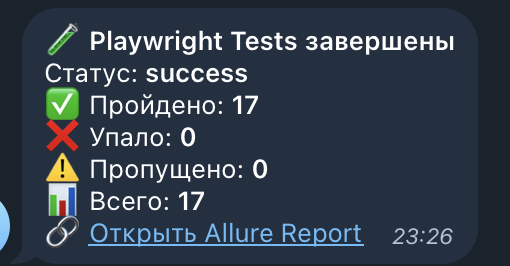

# Дипломный проект автоматизации тестирования

## Описание
Данный репозиторий представляет собой дипломный проект, выполненный в рамках курсов по автоматизации тестирования. Проект направлен на демонстрацию навыков разработки и внедрения автоматизированных тестов для веб-приложений и RESTful API.

В качестве объектов тестирования используются:

**academubugs.com** — образовательный веб-сайт, предоставляющий функционал для практики автоматизации тестирования пользовательского интерфейса.

**restful-booker.herokuapp.com** — тестовое RESTful API, предназначенное для отработки навыков автоматизации тестирования взаимодействия с серверной частью приложений.

Использование данных продуктов обусловлено их доступностью, открытостью и специальной адаптацией для учебных целей. Это позволяет избежать применения реальных коммерческих систем, которые могут быть ограничены в правах использования или содержать конфиденциальные данные.

## Технологический стек


Проект реализован с использованием следующих технологий и инструментов:

* JavaScript : Язык программирования, используемый для разработки тестов.
* Playwright : Фреймворк для автоматизации тестирования пользовательского интерфейса (UI) и взаимодействия с веб-приложениями.
* GitHub : Платформа для хостинга кода и управления версиями, а также для настройки CI/CD через GitHub Actions.
* Jenkins : Система непрерывной интеграции (CI), обеспечивающая автоматизированный запуск тестов, генерацию отчетов и интеграцию с внешними сервисами.
* Allure TestOps : Инструмент для управления тестированием и анализа результатов, интегрированный в процесс через Allure Report.
* Telegram : Платформа для отправки уведомлений о результатах выполнения тестов.

## Запуск тестов через Jenkins
Для выполнения запуска пайплайна необходимо выполнить следующие шаги:

1. Авторизация в Jenkins:
Войдите в Jenkins, используя свои учетные данные.
2. Переход к джобе:
Перейдите в раздел с настроенной джобой, отвечающей за выполнение тестов и генерацию отчетов.
3. Запуск сборки: 
Нажмите кнопку "Build Now" для инициации процесса выполнения пайплайна.

**После завершения сборки:**

Будет сформирован Allure-отчет, содержащий детальную информацию о результатах тестирования.
Результаты сборки будут автоматически отправлены в Allure TestOps для дальнейшего анализа.
Уведомление о статусе выполнения будет отправлено в Telegram , что позволяет оперативно отслеживать результаты.

## Запуск тестов и генерация отчетов

Команда для локального запуска тестов
```
npx playwright test
```
Команда для локального формирования отчета
```
npx allure generate allure-results
npx allure open
```

## Пример сформированного allure
[Ссылка на отчет](https://a-chubarev.github.io/diplom_qaguru)


## Отчет в TestOps
[Ссылка на проект](https://allure.autotests.cloud/project/4729)


## Отправка сообщений в telegram
